 
   
   # My portfolio
### Applied Data Sciences KB-74
### Jorge Edmundo Ortiz Durán
### Student Number 17170311
https://www.linkedin.com/in/jorge-edmundo-ortiz-dur%C3%A1n-54a825155/

1. ### Introduction

My name is Jorge, I am 23 years old and I am Mexican, I am a student of the computer systems engineering career at the Instituto Politécnico Nacional, in Mexico. I am currently in the Applied Data Science course, at TheHague University of Applied Sciences, in the Netherlands. I am working on a project called CyberSecurity. In this project we apply the concepts and use the tools provided by the course. Libraries like Tweepy, Pandas and Numpy are also used.
Part of the tasks we have to complete during the course is to finish courses that have been assigned to us on the DataCamp and Coursera platform, in order to learn how to use tools to achieve our goal in our project. Below is a compilation of the work I have done during this course.

2. ### Jargon
 
Used jargon for Cybersecurity is listed below.

 * _API_.- Abbreviation for application programming interface: a way ofcommunicating with a particular computer program or internet service.
 
 * _Cyberattack_.- An attempt by hackers to damage or destroy a computer network or system.
 
 * _Cybersecurity_.- The state of being protected against the criminal or unauthorized use of electronic data, or the measures taken to achieve this.
 
 * _Hacktivism_.- The activity of getting into computer systems without permission inorder to achieve political aims.
 
 * _Hacktivist_.- A person who gains unauthorized access to computer files or networks in order to further social or political ends.
 
 * _Sentiment Analysis_.- The process of computationally identifying and categorizing opinions expressed in a piece of text, especially in order to determine whether the writer's attitude towards a particular topic, product, etc. is positive, negative, or neutral.
 
 * _Social media_.- Refers to websites and computer programs that make communication possible with the use of computers or mobile phones.

                
3. ### Data Camp assignments
Here I attached the proof of the accomplish of all the courses that we had to take during this course to 
prepare ourselfs for the project, and get tools for the developing of the Python and Machine Learning tasks.

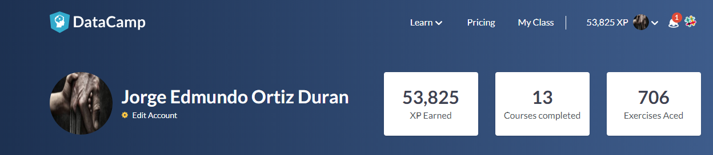

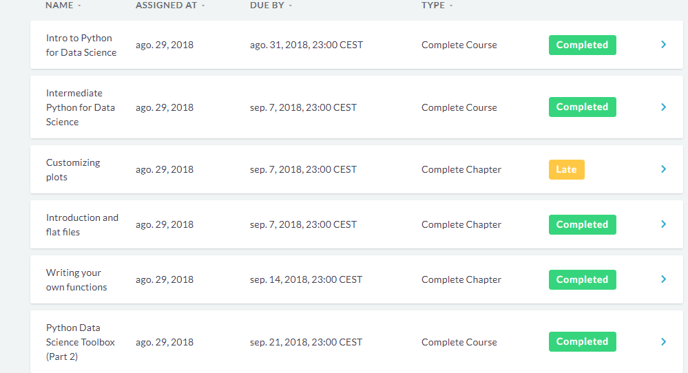

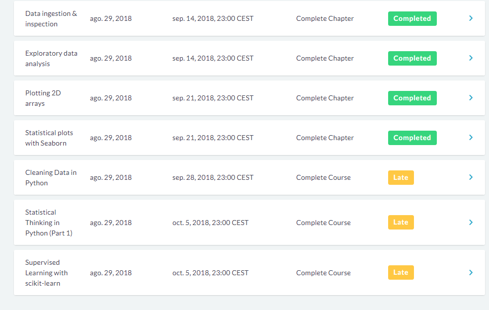
                

4. ### Another Data Camp Courses

     * 1.- [Deep Learning in Python](Statement_of_Accomplishment_Deep_Learning_in_Python.pdf)
 
     * 2.- [Linear Classifiers in Python](Statement_of_Accomplishment_Linear_Classifiers_in_Python_Course.pdf)
     
     * 3.- [Importing data in Python (Part 2) ](Statement_of_Accomplishment_importing_data_in_python_part_2.pdf)
     
 5. ### Coursera
 And also here I attached the proof of the finished chapters on Coursera platform.
 
 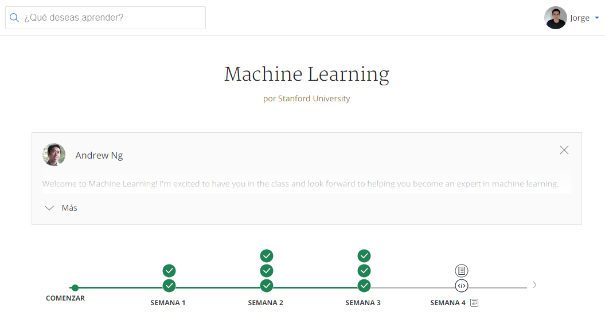
 
  

6. ### Python Notebooks about the project as an evidence of my abilities

In this section I put some of my personal programmes that we used for our project to extract the data from an excel file 
to a list and then extract the tweets of the users, in that Python Notebook that was my collaboration and in the other one I made it all 
and that programme clean the data and then export the data to a csv so then we can label the tweets and make it ready to use it in the classifier.
   
   
   * 1.- [Extract tweets](MAIN-Excell.pdf)
     
   * 2.- [Cleaning Data](Cleaning_Data_Programme.pdf)    
   
   * 3.- [Naive Bayes and SMV comparation](Naive_Bayes_SMV_comparation_Classifiers.pdf)  
   
 
 
7. ### Some visual content
   #### All the fragments of code that are bellow in this section, its in the python codes that are shown above.
   
   Those are also some graphics that I did in our code to see the most frequent words in the Tweets, they are the first ones because still missing to take away the common english words like 'the', 'a', and that words. But here its a good aproach of the handle of the tools for visualating the data.
   
   In this part I am showing the extracts of the tweets that we did at the begining of the project.
   
   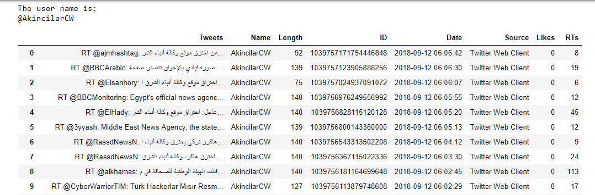 
   
   Here is the code used to clean the data from those characters that are unimportant for os.
   
   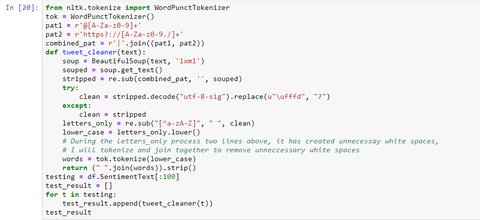 
   
   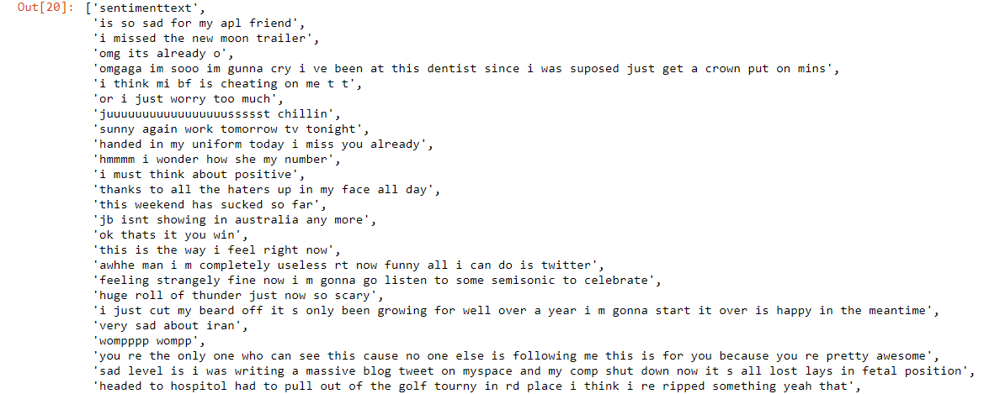 
   
   
   Those are some graphics about the frecuency of words from hacktivist users and non-hacktivist users.
   
 
   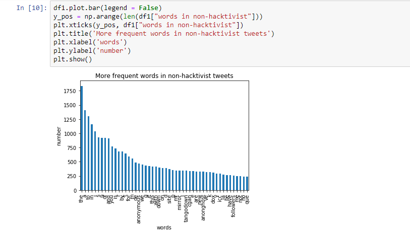 
   
 
 
   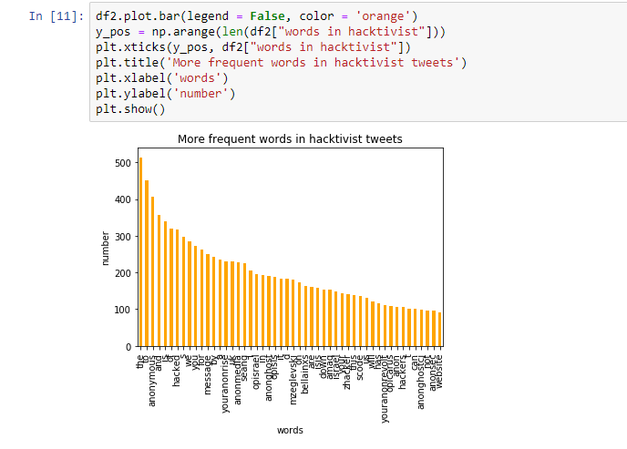 
   
   Here I put the two classifiers that I did, its a table that shows different values for each iteration so then we can see which one is 
   the best value to use. 
   In this case this is Naive Bayes
    
   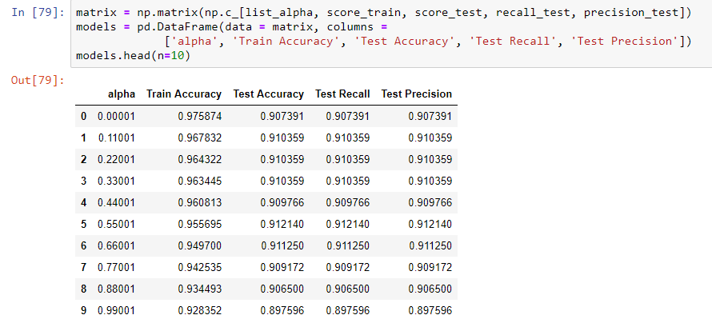 
   
   And here is the same comparation but with SMV
   
   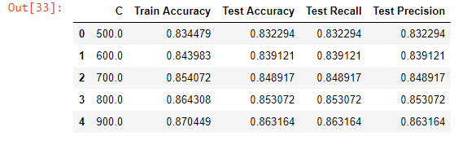 
   
   Now we can see in this block of code that we choose the best value for each classifier.
   
   Naive Bayes
   
   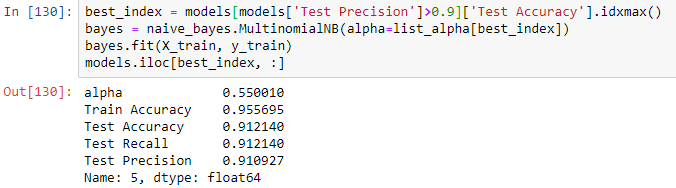 
   
   SMV
   
    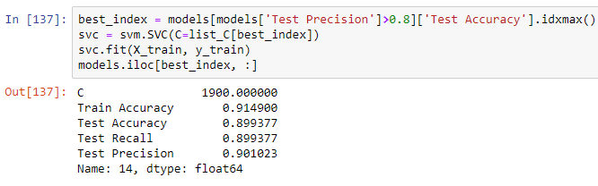 
    
8. ### Presentations
    
    
     * 1.- [My first Presentation](cybersecurity_week3.pdf)
     
     
     * 2.- [My Second Presentation](cybersecurity_week9.pdf)
     

7. ### References

    * 1.- Raúl E. López Briega. (2017). Procesamiento de Lenguaje Natural con Python. 25/10/2018, de Blog Sitio web: https://relopezbriega.github.io/blog/2017/09/23/procesamiento-del-lenguaje-natural-con-python/ 
    
    * 2.- tthustla. (2018). Another Twitter Sentiment Analysis with Python - Part 1. 26/10/2018, de GitHub Sitio web: https://github.com/tthustla/twitter_sentiment_analysis_part1/blob/master/Capstone_part2.ipynb
    
    * 3.- Alec Go, Richa Bhayani y Lei Huang (2009). Twitter Sentiment Classification using Distant Supervision,*academia.edu.9*,1-6.
    
    * 4.- Cambridge University Press. (2018). Cambridge Dictionary. 09/11/2018, de Cambridge University Press Sitio web: https://dictionary.cambridge.org/dictionary/english/
    

